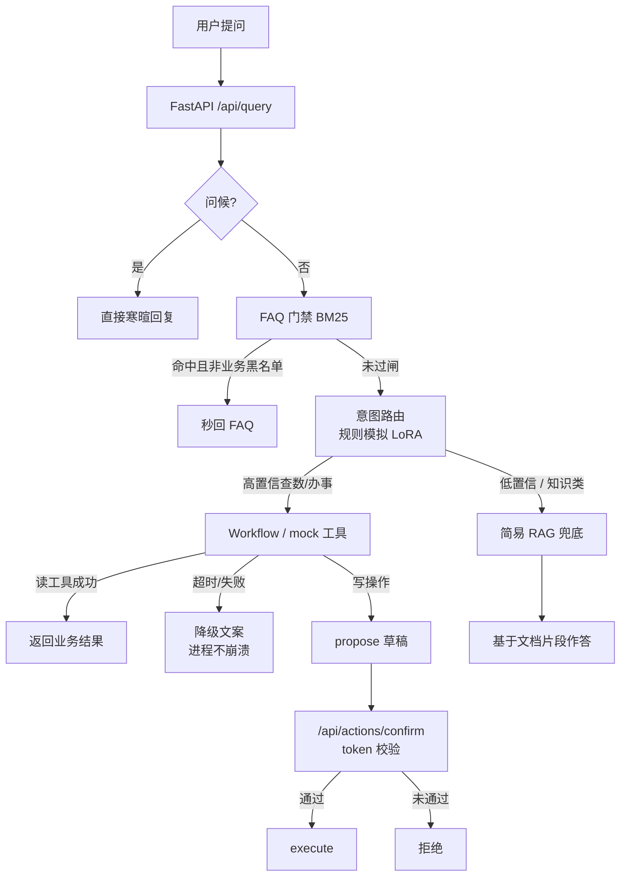

# ops-assistant

> **最小复刻**：同构展示「FAQ 门禁 → 意图路由 → 工具/工作流 → RAG 兜底 → 写操作确认闸 → 离线评测」。  
> **不是**任何公司的生产代码或数据；场景为虚构的「园区运维助手」。

## 和真实项目的关系

| 真实任职项目（不公开） | 本 Demo |
|------------------------|---------|
| 任职项目（内部业务助手，不公开） | 虚构园区运维助手 |
| FAQ + BM25 多层门禁 | `app/faq_gate.py` + 合成 FAQ |
| 意图 LoRA（Qwen2.5-7B） | 规则/关键词路由（可替换接口） |
| MCP / A2A Knowledge | 进程内 mock 工具 |
| Milvus + BGE RAG | 内存关键词检索 |
| Redis 会话 | 内存 dict |
| enterprise_eval 大题集 | `data/eval/` 小回归集 |


## 环境要求
- Python 3.10+
- 无需 GPU、无需 API Key


## 快速开始

```bash
git clone https://github.com/BoneD-Q/ops-assistant.git
cd ops-assistant
python -m venv .venv
# Windows:
.venv\Scripts\activate
pip install -r requirements.txt

# 跑离线评测（无需 API Key）
python scripts/run_eval.py

# 起 HTTP 服务
uvicorn app.main:app --reload --port 8088
```

试问：

```bash
curl -s -X POST http://127.0.0.1:8088/api/query -H "Content-Type: application/json" -d "{\"query\": \"访客登记怎么办理？\"}"
curl -s -X POST http://127.0.0.1:8088/api/query -H "Content-Type: application/json" -d "{\"query\": \"A座今日用电多少？\"}"
```

写操作（propose → confirm）：

```bash
curl -s -X POST http://127.0.0.1:8088/api/query -H "Content-Type: application/json" -d "{\"query\": \"帮我消掉告警 ALERT-1001\"}"
# 记下 proposal_id，再：
curl -s -X POST http://127.0.0.1:8088/api/actions/confirm -H "Content-Type: application/json" -d "{\"proposal_id\": \"...\", \"token\": \"demo-operator\"}"
```

## 架构（主路径）




```
问候短路
  → FAQ 门禁（高分且非业务黑名单才秒回）
  → 意图路由（规则模拟 LoRA：高置信进 Workflow，否则 RAG）
  → Workflow / mock 工具
  → 失败或知识类 → RAG 兜底
写操作：只 propose，confirm 后 execute
工具失败：重试 ≤2 → 降级文案（不崩进程）
```

## 目录

```
app/           # FastAPI + 编排核心
data/          # 合成 FAQ / 文档 / 评测题
scripts/       # 离线评测入口
tests/         # pytest
```

## License

MIT — 仅供作品集与面试演示。
